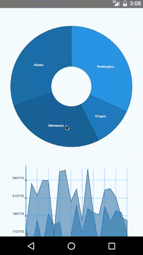

react-native-pathjs-charts
=======================

[](https://www.npmjs.com/package/react-native-pathjs-charts) [](https://www.npmjs.com/package/react-native-svg)  [](https://facebook.github.io/react-native/)
[](http://developer.android.com/sdk/index.html)
[](https://developer.apple.com/xcode/)
[](http://www.apache.org/licenses/LICENSE-2.0)

This library is a cross-platform (iOS/Android) library of charts/graphs using [react-native-svg](https://github.com/magicismight/react-native-svg) and [paths-js](https://github.com/andreaferretti/paths-js) based on the excellent work done by Roman Samec in the [react-pathjs-chart](https://github.com/rsamec/react-pathjs-chart) library. The project is an early attempt at providing a ubiquitous solution for charts & graphs for React Native that offer a unified view across devices.

Components include Pie charts, Bar charts, Smoothline charts, Stockline charts, Scatterplots, Tree graphs and Radar graphs. Since Paths-Js makes no assumptions about rendering, this library is perfect for using SVG path objects to render custom charts easily.

This library is in its early stages, but I welcome contributors who would like to help make this the charting solution for React Native. Many of our mobile experiences need to create dashboards. Up to now, we've only been seeing libraries that are native bridges. Wouldn't it be great to have a cross platform solution that just worked?

  

## Current Features

+ Pie, Bar, Smoothline, Stockline, Scatterplot, Tree and Radar graphs
+ Configuration of format, labels, colors, axis, ticks, lines
+ No touch support (yet)
+ No animations (yet)
+ Chart information configurable based on data parameters which specify which variables are accessors
+ Rendering works on iOS/Android
+ No native dependencies for linking (except linking required by [react-native-svg](https://github.com/magicismight/react-native-svg))

## Example Application

To run the example application (from a cloned repo):

```
cd example
npm install
react-native link react-native-svg
react-native run-ios
# or
react-native run-android
```

## Installation

To add the library to your React Native project:

```
npm install react-native-pathjs-charts --save
react-native link react-native-svg
```

## Usage

```javascript
render() {
    return (   
      <ScrollView style={{flex:1,backgroundColor:'#F5FCFF'}}          
                  contentContainerStyle={{justifyContent:'center',alignItems:'center'}}>
        <Bar
            data={sampleData.bar.data}
            options={sampleData.bar.options}
            accessorKey='v'/>
        <Pie
            data={sampleData.pie.data}
            options={sampleData.pie.options}
            accessorKey="population" />
        <StockLine
            data={sampleData.stockLine.data}
            options={sampleData.stockLine.options}
            xKey='x'
            yKey='y' />
        <SmoothLine
            data={sampleData.smoothLine.data}
            options={sampleData.smoothLine.options}
            xKey='x'
            yKey='y' />
        <Scatterplot
            data={sampleData.scatterplot.data}
            options={sampleData.scatterplot.options}
            xKey="episode"
            yKey="rating" />
        <Radar
            data={sampleData.radar.data}
            options={sampleData.radar.options} />
        <Tree
            data={sampleData.tree.data}
            options={sampleData.tree.options}  />
      </ScrollView>)
  }

```

### Properties

+   data - chart data to visualize (Format in JSON)
+   accessor - the accessor is a string that defines property names in data that represent axis/chart-data (for example, if I have "income" in my data that I want on the x-axis of my StockLine chart, I will set `xKey='income'`
    +   Pie, Bar - __accessorKey__
    +   SmoothLine,StockLine,Scatterplot - __xKey__, __yKey__
+   options - visual configuration of chart, enables to configure  formats, labels, colors, axis, ticks, lines
+   noDataMessage - message to show if no data or empty data are specified

## Todo

For this library to really shine, there are a lot of improvements to be made. Here are some of my top ideas:
+ Add basic animations to draw the charts
+ Add touch functionality (as the react-native-svg library adds touch features)
+ Add the ability to absolutely position regular React-Native views in relation to SVG chart elements
+ More chart types
+ More axis controls (to control scale)
+ Add View component support to allow custom components instead of message when no data appears
+ Events
+ More documentation, information on configuration
+ Extended examples
+ Bug fixing, unit testing, cleanup
+ CICD pipeline with confirmed build success

## Example Data & Options:

```javascript
export default sampleData = {
    bar: {
        data: [
            [{
                "v": 49,
                "name": "apple"
            }, {
                "v": 42,
                "name": "apple"
            }],
            [{
                "v": 69,
                "name": "banana"
            }, {
                "v": 62,
                "name": "banana"
            }],
            [{
                "v": 29,
                "name": "grape"
            }, {
                "v": 15,
                "name": "grape"
            }]
        ],
        options: {
            width: 300,
            height: 300,
            margin: {
                top: 20,
                left: 25,
                bottom: 50,
                right: 20
            },
            color: '#2980B9',
            gutter: 20,
            animate: {
                type: 'oneByOne',
                duration: 200,
                fillTransition: 3
            },
            axisX: {
                showAxis: true,
                showLines: true,
                showLabels: true,
                showTicks: true,
                zeroAxis: false,
                orient: 'bottom',
                label: {
                    fontFamily: 'Arial',
                    fontSize: 8,
                    fontWeight: true,
                    fill: '#34495E'
                }
            },
            axisY: {
                showAxis: true,
                showLines: true,
                showLabels: true,
                showTicks: true,
                zeroAxis: false,
                orient: 'left',
                label: {
                    fontFamily: 'Arial',
                    fontSize: 8,
                    fontWeight: true,
                    fill: '#34495E'
                }
            }
        }
    },
    pie: {
        data: [{
            "name": "Alagoas",
            "population": 1962903
        }, {
            "name": "Maranhão",
            "population": 2805387
        }, {
            "name": "São Paulo",
            "population": 6460102
        }, {
            "name": "Goiás",
            "population": 4157509
        }, {
            "name": "Sergipe",
            "population": 2637097
        }, {
            "name": "Rondônia",
            "population": 3552899
        }],
        options: {
            margin: {
                top: 20,
                left: 20,
                right: 20,
                bottom: 20
            },
            width: 600,
            height: 600,
            color: '#2980B9',
            r: 100,
            R: 200,
            legendPosition: 'topLeft',
            animate: {
                type: 'oneByOne',
                duration: 200,
                fillTransition: 3
            },
            label: {
                fontFamily: 'Arial',
                fontSize: 14,
                fontWeight: true,
                color: '#ECF0F1'
            }
        }
    },
    stockLine: {
        data: [
            [{
                "x": 0,
                "y": 47782
            }, {
                "x": 1,
                "y": 48497
            }, {
                "x": 2,
                "y": 77128
            }, {
                "x": 3,
                "y": 73413
            }, {
                "x": 4,
                "y": 58257
            }, {
                "x": 5,
                "y": 40579
            }, {
                "x": 6,
                "y": 72893
            }, {
                "x": 7,
                "y": 60663
            }, {
                "x": 8,
                "y": 15715
            }, {
                "x": 9,
                "y": 40305
            }, {
                "x": 10,
                "y": 68592
            }, {
                "x": 11,
                "y": 95664
            }, {
                "x": 12,
                "y": 17908
            }, {
                "x": 13,
                "y": 22838
            }, {
                "x": 14,
                "y": 32153
            }, {
                "x": 15,
                "y": 56594
            }, {
                "x": 16,
                "y": 76348
            }, {
                "x": 17,
                "y": 46222
            }, {
                "x": 18,
                "y": 59304
            }],
            [{
                "x": 0,
                "y": 132189
            }, {
                "x": 1,
                "y": 61705
            }, {
                "x": 2,
                "y": 154976
            }, {
                "x": 3,
                "y": 81304
            }, {
                "x": 4,
                "y": 172572
            }, {
                "x": 5,
                "y": 140656
            }, {
                "x": 6,
                "y": 148606
            }, {
                "x": 7,
                "y": 53010
            }, {
                "x": 8,
                "y": 110783
            }, {
                "x": 9,
                "y": 196446
            }, {
                "x": 10,
                "y": 117057
            }, {
                "x": 11,
                "y": 186765
            }, {
                "x": 12,
                "y": 174908
            }, {
                "x": 13,
                "y": 75247
            }, {
                "x": 14,
                "y": 192894
            }, {
                "x": 15,
                "y": 150356
            }, {
                "x": 16,
                "y": 180360
            }, {
                "x": 17,
                "y": 175697
            }, {
                "x": 18,
                "y": 114967
            }],
            [{
                "x": 0,
                "y": 125797
            }, {
                "x": 1,
                "y": 256656
            }, {
                "x": 2,
                "y": 222260
            }, {
                "x": 3,
                "y": 265642
            }, {
                "x": 4,
                "y": 263902
            }, {
                "x": 5,
                "y": 113453
            }, {
                "x": 6,
                "y": 289461
            }, {
                "x": 7,
                "y": 293850
            }, {
                "x": 8,
                "y": 206079
            }, {
                "x": 9,
                "y": 240859
            }, {
                "x": 10,
                "y": 152776
            }, {
                "x": 11,
                "y": 297282
            }, {
                "x": 12,
                "y": 175177
            }, {
                "x": 13,
                "y": 169233
            }, {
                "x": 14,
                "y": 237827
            }, {
                "x": 15,
                "y": 242429
            }, {
                "x": 16,
                "y": 218230
            }, {
                "x": 17,
                "y": 161511
            }, {
                "x": 18,
                "y": 153227
            }]
        ],
        options: {
            width: 250,
            height: 250,
            color: '#2980B9',
            margin: {
                top: 10,
                left: 35,
                bottom: 30,
                right: 10
            },
            animate: {
                type: 'delayed',
                duration: 200
            },
            axisX: {
                showAxis: true,
                showLines: true,
                showLabels: true,
                showTicks: true,
                zeroAxis: false,
                orient: 'bottom',
                tickValues: [],
                label: {
                    fontFamily: 'Arial',
                    fontSize: 8,
                    fontWeight: true,
                    fill: '#34495E'
                }
            },
            axisY: {
                showAxis: true,
                showLines: true,
                showLabels: true,
                showTicks: true,
                zeroAxis: false,
                orient: 'left',
                tickValues: [],
                label: {
                    fontFamily: 'Arial',
                    fontSize: 8,
                    fontWeight: true,
                    fill: '#34495E'
                }
            }
        }
    },
    smoothLine: {
        data: [
            [{
                "x": -10,
                "y": -1000
            }, {
                "x": -9,
                "y": -729
            }, {
                "x": -8,
                "y": -512
            }, {
                "x": -7,
                "y": -343
            }, {
                "x": -6,
                "y": -216
            }, {
                "x": -5,
                "y": -125
            }, {
                "x": -4,
                "y": -64
            }, {
                "x": -3,
                "y": -27
            }, {
                "x": -2,
                "y": -8
            }, {
                "x": -1,
                "y": -1
            }, {
                "x": 0,
                "y": 0
            }, {
                "x": 1,
                "y": 1
            }, {
                "x": 2,
                "y": 8
            }, {
                "x": 3,
                "y": 27
            }, {
                "x": 4,
                "y": 64
            }, {
                "x": 5,
                "y": 125
            }, {
                "x": 6,
                "y": 216
            }, {
                "x": 7,
                "y": 343
            }, {
                "x": 8,
                "y": 512
            }, {
                "x": 9,
                "y": 729
            }, {
                "x": 10,
                "y": 1000
            }],
            [{
                "x": -10,
                "y": 100
            }, {
                "x": -9,
                "y": 81
            }, {
                "x": -8,
                "y": 64
            }, {
                "x": -7,
                "y": 49
            }, {
                "x": -6,
                "y": 36
            }, {
                "x": -5,
                "y": 25
            }, {
                "x": -4,
                "y": 16
            }, {
                "x": -3,
                "y": 9
            }, {
                "x": -2,
                "y": 4
            }, {
                "x": -1,
                "y": 1
            }, {
                "x": 0,
                "y": 0
            }, {
                "x": 1,
                "y": 1
            }, {
                "x": 2,
                "y": 4
            }, {
                "x": 3,
                "y": 9
            }, {
                "x": 4,
                "y": 16
            }, {
                "x": 5,
                "y": 25
            }, {
                "x": 6,
                "y": 36
            }, {
                "x": 7,
                "y": 49
            }, {
                "x": 8,
                "y": 64
            }, {
                "x": 9,
                "y": 81
            }, {
                "x": 10,
                "y": 100
            }]
        ],
        options: {
            width: 280,
            height: 280,
            color: '#2980B9',
            margin: {
                top: 20,
                left: 45,
                bottom: 25,
                right: 20
            },
            animate: {
                type: 'delayed',
                duration: 200
            },
            axisX: {
                showAxis: true,
                showLines: true,
                showLabels: true,
                showTicks: true,
                zeroAxis: false,
                orient: 'bottom',
                label: {
                    fontFamily: 'Arial',
                    fontSize: 14,
                    fontWeight: true,
                    fill: '#34495E'
                }
            },
            axisY: {
                showAxis: true,
                showLines: true,
                showLabels: true,
                showTicks: true,
                zeroAxis: false,
                orient: 'left',
                label: {
                    fontFamily: 'Arial',
                    fontSize: 14,
                    fontWeight: true,
                    fill: '#34495E'
                }
            }
        }
    },
    scatterplot: {
        data: [
            [{
                "title": "Amapá",
                "rating": 4.47,
                "episode": 0
            }, {
                "title": "Santa Catarina",
                "rating": 3.3,
                "episode": 1
            }, {
                "title": "Minas Gerais",
                "rating": 6.46,
                "episode": 2
            }, {
                "title": "Amazonas",
                "rating": 3.87,
                "episode": 3
            }, {
                "title": "Mato Grosso do Sul",
                "rating": 2.8,
                "episode": 4
            }, {
                "title": "Mato Grosso do Sul",
                "rating": 2.05,
                "episode": 5
            }, {
                "title": "Tocantins",
                "rating": 7.28,
                "episode": 6
            }, {
                "title": "Roraima",
                "rating": 5.23,
                "episode": 7
            }, {
                "title": "Roraima",
                "rating": 7.76,
                "episode": 8
            }, {
                "title": "Amazonas",
                "rating": 2.26,
                "episode": 9
            }, {
                "title": "Mato Grosso do Sul",
                "rating": 2.46,
                "episode": 10
            }, {
                "title": "Santa Catarina",
                "rating": 7.59,
                "episode": 11
            }, {
                "title": "Acre",
                "rating": 3.74,
                "episode": 12
            }, {
                "title": "Amapá",
                "rating": 5.03,
                "episode": 13
            }, {
                "title": "Paraíba",
                "rating": 4.16,
                "episode": 14
            }, {
                "title": "Mato Grosso",
                "rating": 0.81,
                "episode": 15
            }, {
                "title": "Rio de Janeiro",
                "rating": 3.01,
                "episode": 16
            }, {
                "title": "Rio de Janeiro",
                "rating": 0,
                "episode": 17
            }, {
                "title": "Distrito Federal",
                "rating": 5.46,
                "episode": 18
            }, {
                "title": "São Paulo",
                "rating": 9.71,
                "episode": 19
            }, {
                "title": "Mato Grosso",
                "rating": 7.9,
                "episode": 20
            }, {
                "title": "Tocantins",
                "rating": 4.2,
                "episode": 21
            }, {
                "title": "Amapá",
                "rating": 6,
                "episode": 22
            }, {
                "title": "Paraná",
                "rating": 7.99,
                "episode": 23
            }, {
                "title": "Mato Grosso do Sul",
                "rating": 1.07,
                "episode": 24
            }, {
                "title": "Tocantins",
                "rating": 1.42,
                "episode": 25
            }, {
                "title": "Paraná",
                "rating": 5.94,
                "episode": 26
            }, {
                "title": "Maranhão",
                "rating": 3.17,
                "episode": 27
            }, {
                "title": "Maranhão",
                "rating": 1.58,
                "episode": 28
            }, {
                "title": "Rondônia",
                "rating": 6.12,
                "episode": 29
            }, {
                "title": "Roraima",
                "rating": 7.28,
                "episode": 30
            }, {
                "title": "Mato Grosso",
                "rating": 4.74,
                "episode": 31
            }, {
                "title": "Roraima",
                "rating": 1.47,
                "episode": 32
            }, {
                "title": "Alagoas",
                "rating": 9,
                "episode": 33
            }, {
                "title": "Amazonas",
                "rating": 0.43,
                "episode": 34
            }, {
                "title": "Mato Grosso do Sul",
                "rating": 8.61,
                "episode": 35
            }, {
                "title": "Tocantins",
                "rating": 0.6,
                "episode": 36
            }, {
                "title": "Maranhão",
                "rating": 9.62,
                "episode": 37
            }, {
                "title": "Rio de Janeiro",
                "rating": 4.79,
                "episode": 38
            }, {
                "title": "Santa Catarina",
                "rating": 7.71,
                "episode": 39
            }, {
                "title": "Piauí",
                "rating": 3.83,
                "episode": 40
            }, {
                "title": "Pernambuco",
                "rating": 8.19,
                "episode": 41
            }, {
                "title": "Bahia",
                "rating": 6.98,
                "episode": 42
            }, {
                "title": "Minas Gerais",
                "rating": 4.52,
                "episode": 43
            }]
        ],
        options: {
            width: 290,
            height: 290,
            r: 2,
            margin: {
                top: 20,
                left: 40,
                bottom: 30,
                right: 30
            },
            fill: "#2980B9",
            stroke: "#3E90F0",
            animate: {
                type: 'delayed',
                duration: 200
            },
            label: {
                fontFamily: 'Arial',
                fontSize: 8,
                fontWeight: true,
                fill: '#34495E'
            },
            axisX: {
                showAxis: true,
                showLines: true,
                showLabels: true,
                showTicks: true,
                zeroAxis: false,
                orient: 'bottom',
                label: {
                    fontFamily: 'Arial',
                    fontSize: 8,
                    fontWeight: true,
                    fill: '#34495E'
                }
            },
            axisY: {
                showAxis: true,
                showLines: true,
                showLabels: true,
                showTicks: true,
                zeroAxis: false,
                orient: 'left',
                label: {
                    fontFamily: 'Arial',
                    fontSize: 8,
                    fontWeight: true,
                    fill: '#34495E'
                }
            }
        }
    },
    radar: {
        data: [{
            "speed": 74,
            "balance": 29,
            "explosives": 40,
            "energy": 40,
            "flexibility": 30,
            "agility": 25,
            "endurance": 44
        }],
        options: {
            width: 290,
            height: 290,
            margin: {
                top: 20,
                left: 20,
                right: 30,
                bottom: 20
            },
            r: 150,
            max: 100,
            fill: "#2980B9",
            stroke: "#2980B9",
            animate: {
                type: 'oneByOne',
                duration: 200
            },
            label: {
                fontFamily: 'Arial',
                fontSize: 14,
                fontWeight: true,
                fill: '#34495E'
            }
        }
    },
    tree: {
        data: {
            "name": "Root",
            "children": [{
                "name": "Santa Catarina",
                "children": [{
                    "name": "Tromp"
                }, {
                    "name": "Thompson"
                }, {
                    "name": "Ryan"
                }]
            }, {
                "name": "Acre",
                "children": [{
                    "name": "Dicki"
                }, {
                    "name": "Armstrong"
                }, {
                    "name": "Nitzsche"
                }]
            }]
        },
        options: {
            margin: {
                top: 20,
                left: 50,
                right: 80,
                bottom: 20
            },
            width: 200,
            height: 200,
            fill: "#2980B9",
            stroke: "#3E90F0",
            r: 2,
            animate: {
                type: 'oneByOne',
                duration: 200,
                fillTransition: 3
            },
            label: {
                fontFamily: 'Arial',
                fontSize: 8,
                fontWeight: true,
                fill: '#34495E'
            }

        }
    },
    pie: {
        data: [{
            "name": "Washington",
            "population": 7694980
        }, {
            "name": "Oregon",
            "population": 2584160
        }, {
            "name": "Minnesota",
            "population": 6590667
        }, {
            "name": "Alaska",
            "population": 7284698
        }],
        options: {
            margin: {
                top: 20,
                left: 20,
                right: 20,
                bottom: 20
            },
            width: 350,
            height: 350,
            color: '#2980B9',
            r: 50,
            R: 150,
            legendPosition: 'topLeft',
            animate: {
                type: 'oneByOne',
                duration: 200,
                fillTransition: 3
            },
            label: {
                fontFamily: 'Arial',
                fontSize: 8,
                fontWeight: true,
                color: '#ECF0F1'
            }
        }
    }
}
```
Contributors:
We welcome your interest in Capital One’s Open Source Projects (the “Project”). Any Contributor to the project must accept and sign a CLA indicating agreement to the license terms. Except for the license granted in this CLA to Capital One and to recipients of software distributed by Capital One, you reserve all right, title, and interest in and to your contributions; this CLA does not impact your rights to use your own contributions for any other purpose.

[Link to CLA](https://docs.google.com/forms/d/19LpBBjykHPox18vrZvBbZUcK6gQTj7qv1O5hCduAZFU/viewform)

This project adheres to the [Open Source Code of Conduct](http://www.capitalone.io/codeofconduct/). By participating, you are expected to honor this code.
